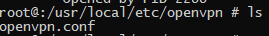
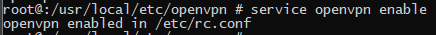

Por medio del instalador de paquetes verificamos las versions que
podemos instalar de mysql.

Instalaremos la version mas reciente disponible de mysql.

Activamos el servicio para que se inicie cada vez que el sistema inicie.

Y iniciamos el servidor de base de datos.

Y verificamos si el servicio esta arriba.

Accedemos a mysql por la consola.

Y modificamos la contraseña del usuario root por motivos de seguridad.

Y creamos un usuario para la conexion.

Para permitir la conexion desde cualquier IP nos vamos a archivo de
configuracion de mysql.

Y modificamos la linea de la Ip para que quede de la siguiente manera.

Y reiniciamos el servicio de mysql.

Probamos la conexion desde otra maquina en mi ccaso usare MYSQL
Workbench.

Instalamos OpenVPN para conectarlo a nuestro servidor VPN y poder
consumirlo desde alli.

Agregamos nuestro archivo de configuracion a la carpeta predeterminada
de open vpn con el nombre "openvpn.conf".

Activamos openvpn para que se active junto con el booteo de la maquina.

Y lo iniciamos.

Ahora utilizando el commando ifconfig, comprobamos que el servidor este
conectado a la VPN.

Una vez agregado a la VPN nos conectamos atravez de esta a la base de
datos utilizando las mismas credenciales.

