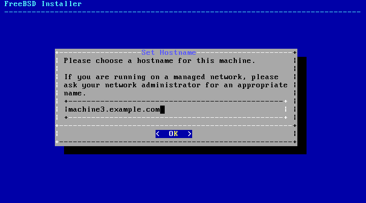
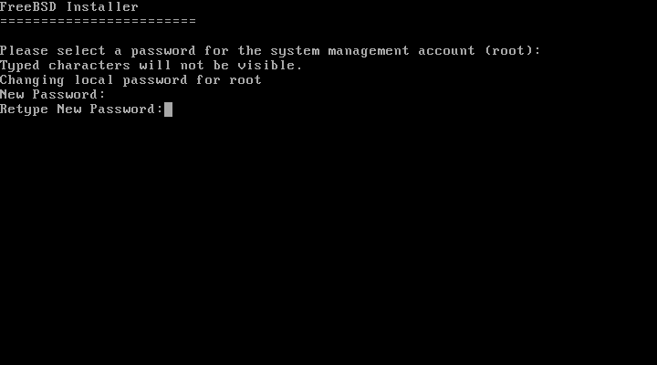
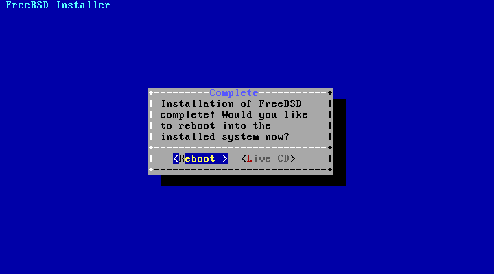

Una vez tengamos nuestro servidor configurado y con la imagen montada
iniciamos la maquina.

Y procedemos a instalar el sistema.

Seleccionamos la distribucion del teclado que usaremos.

Despues agregaremos el hostname de la maquina.

Y seleccionaremos los components a instalar.

En nuestro caso utilizamos los componentes:

\*Base-dbg

\*Kernel-dbg

\*Lib32-dbg

\*ports

Despues seleccionaremos como deseamos que se distribuya el espacio del
disco.

Seleccionamos el disco duro en el cual haremos la
instalacion

Y le decimos que utilizaremos toda la unidad.

Confirmamos la accion.

Finalizamos la configuracion de Freebsd.

Empieza la instalacion del sistema base y los components que escogimos.

Colocamos una contraseña para el usuario root.

Y habilitamos los servicios que queremos en nuestro caso habilitamos el
SSH para conectarnos a esta maquina y el log de errores del kernel.

Una vez finalizado aplicamos la configuracion y salimos del instalador.

