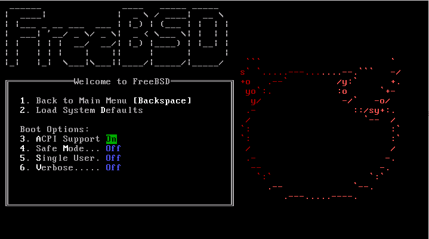
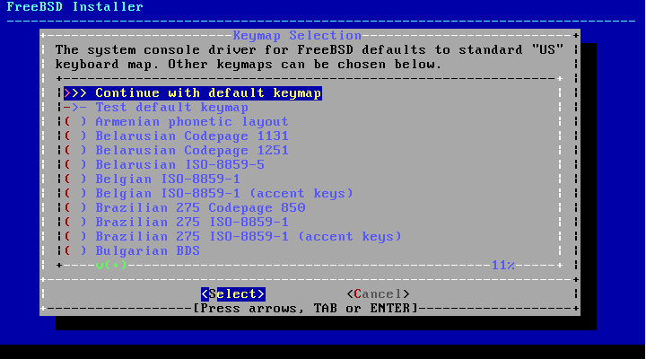
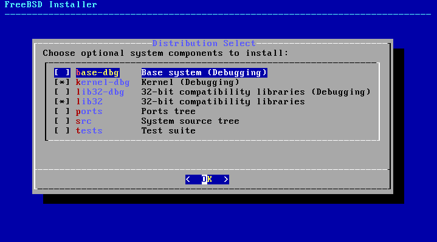
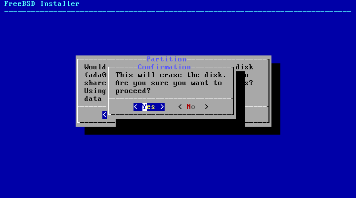

Una vez tengamos nuestro servidor configurado y con la imagen montada
iniciamos la maquina

{width="6.5in"
height="3.615972222222222in"}

Y procedemos a instalar el sistema

{width="6.5in"
height="3.609722222222222in"}

Seleccionamos la distribucion del teclado que usaremos

{width="6.5in"
height="3.609722222222222in"}

Despues agregaremos el hostname de la maquina

{width="6.5in"
height="3.609722222222222in"}

Y seleccionaremos los components a instalar

En nuestro caso utilizamos los components:

\*Base-dbg

\*Kernel-dbg

\*Lib32-dbg

\*ports

{width="6.5in"
height="3.6041666666666665in"}

Despues seleccionaremos como deseamos que se distribuya el espacio del
disco

{width="6.5in"
height="3.609722222222222in"}

Seleccionamos el disco duro en el cual haremos la
instalacion{width="6.5in"
height="3.609722222222222in"}

Y le decimos que utilizaremos toda la unidad

{width="6.5in"
height="3.609722222222222in"}

Confirmamos la accion

{width="6.5in"
height="3.609722222222222in"}

Finalizamos la configuracion de Freebsd

{width="6.5in"
height="3.609722222222222in"}

Empieza la instalacion del sistema base y los components que escogimos

{width="6.5in"
height="3.609722222222222in"}

Colocamos una contraseña para el usuario root

{width="6.5in"
height="3.609722222222222in"}

Y habilitamos los servicios que queremos en nuestro caso habilitamos el
SSH para conectarnos a esta maquina y el log de errores del kernel

{width="6.5in"
height="3.609722222222222in"}

Una vez finalizado aplicamos la configuracion y salimos del instalador

{width="6.5in"
height="3.609722222222222in"}

{width="6.5in"
height="3.609722222222222in"}
