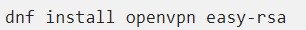
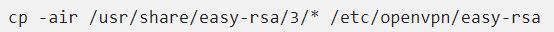
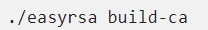
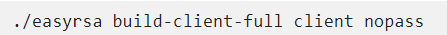
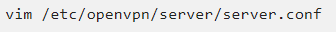

Primero instalamos easy-rsa

Creamos un directorio para los certificados.

Copiamor los archivos de la carpeta de certificados a la carpeta de
certificados de OpenVPN.

Inicializamos los certificados CA.

Y lo construimos.

Generamos la llave Diffie-Hellman.

Generamos la llave y los certificados.

Y generamos un certificado para el cliente.

Despues generaremos el certificado TLS/SSL.

Definimos los parametros de OpenVPN.

Una vez terminado de configurar los parametros crearemos los clientes,
en nuestro caso creamos 4 clientes de VPN.

./easyrsa build-client-full client nopass

./easyrsa build-client-full client2 nopass

./easyrsa build-client-full client3 nopass

./easyrsa build-client-full client4 nopass

